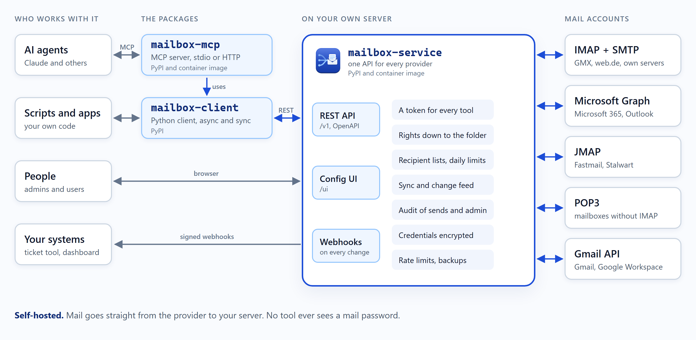

#  Mailbox

[](https://github.com/benethos-hub/mailbox/actions/workflows/ci.yml)
[](https://pypi.org/project/benethos-mailbox-service/)
[](https://pypi.org/project/benethos-mailbox-mcp/)
[](https://pypi.org/project/benethos-mailbox-client/)
[](https://github.com/benethos-hub/mailbox/pkgs/container/benethos-mailbox-service)
[](https://github.com/benethos-hub/mailbox/pkgs/container/benethos-mailbox-mcp)
[](https://pypi.org/project/benethos-mailbox-service/)
[](https://github.com/benethos-hub/mailbox/actions/workflows/ci.yml)
[](https://github.com/benethos-hub/mailbox/blob/main/LICENSE)

One REST API for all your mailboxes, whichever provider they are at, a
Python client for it and an MCP server on top. Scripts, tools and AI
agents work with your mail through one door you control.

> **Status: beta, version 0.3.1.** Usable with real accounts. A breaking
> change of the API or the configuration is announced in the changelog.
> Stored data is carried forward by migrations.

## What it is for

Most people and small companies have more than one mail account: a
personal address at GMX or web.de, a company mailbox at Microsoft 365, an
info@ address at some hoster, maybe a Gmail account. Each speaks its own
dialect: IMAP here, Microsoft Graph there. Every tool that wants to work
with mail has to learn all of them and has to be given the passwords.

Mailbox turns that around. It has three parts. `mailbox-service` runs on
your own machine or server and holds the connections to all accounts.
Everything else talks to that service only, through one REST API that
looks the same for every provider. `mailbox-client` is the Python
client of that API, for scripts and apps. `mailbox-mcp`, the MCP
server, builds on the client and opens the service to AI agents. The
service decides who may do what. A script, an app or an AI agent gets
a token of its own. That token opens exactly the accounts and
operations it was given, nothing more.

<picture>
  <source srcset="assets/architecture/architecture-dark.png" media="(prefers-color-scheme: dark)">
  
</picture>

That makes a few things simple that are hard otherwise.

### Working with an AI agent in your mail

Through the MCP server, Claude or another AI agent works with every
account you gave it. A few requests it handles today:

- "What came in since last night?"
- "Move every invoice from Company XY to the folder Accounting."
- "Forward today's invoices to our tax advisor."
- "Show me all mail from Company XY between the 1st and the 15th of
  September."
- "Which mails with attachments came this week? Read the invoice and tell
  me the amount and the due date."
- "Sum up the mails about the offer and write a draft reply."
- "Mark last week's newsletters as read and move them to the archive."

Its rights decide whether it may send on its own or only leave drafts
for a person to send. A grant can also name the recipients it may write
to, such as the tax advisor's address alone, and how many mails it may
send a day. A mail to anyone else is refused. It can keep the agent to
some folders, such as the invoices, and end after a week.

### More uses

- **Controlled access.** A bookkeeping tool reads the invoice folder of
  one account and nothing else. It may neither send nor delete, and it
  never sees a mail password, only its own token.
- **Automation across accounts.** A script files invoices, archives
  newsletters and forwards order confirmations. It works the same way for
  GMX, Microsoft 365 and your own mail server.
- **Sending with guard rails.** A newsletter job sends from info@, to a
  fixed list of recipients, at most a few times a day.
- **React instead of polling.** Signed webhooks tell your own system
  about new mail, a ticket tool or an internal dashboard for example.
- **Traceable.** Every send is recorded in the audit: by whom, when and
  under which grant. So is every sign-in and every change to users,
  tokens, roles, accounts and webhooks.
- **One inbox for your own tools.** A dashboard or a small internal app
  lists, searches and answers mail from every account with one client.
- **Self-hosted.** The service stores the credentials encrypted. Mail
  goes straight from the provider to you, never through a third party's
  cloud.

## What it can do today

- **Accounts:** IMAP with SMTP for sending, set up from the address alone
  (autodiscovery), JMAP servers such as Fastmail and Stalwart, POP3
  for mailboxes without IMAP (the inbox only), and Microsoft accounts
  (Outlook.com, Microsoft 365) over Microsoft Graph with OAuth sign-in.
  Credentials are encrypted (AES-256-GCM) under a master key kept
  outside the database.
- **Reading:** folders, lists and search, one account or all at once,
  messages as text and HTML, attachments, the raw source. Message ids stay
  the same when a message moves, kept by a background sync.
- **Writing:** flags, moving, deleting, folders, drafts, and sending with
  reply, reply to all and forward. A retried send is not sent twice
  (`Idempotency-Key`).
- **Changes:** a change feed names each message created, changed or
  deleted since a point you keep, in IMAP, JMAP, POP3 and Microsoft
  accounts, flags set in other mail clients included where the IMAP
  server offers CONDSTORE. Webhooks post the same events, signed, to a URL of your
  choice, a host in your local network included.
- **Users and rights:** users, roles and grants per account and per
  operation, down to folders, grants that expire, API tokens, limits on
  sending (allowed recipients, sends per day), an audit of every send
  and an audit of administration.
- **MCP server:** reads, sorts, writes drafts, sends and tells what is
  new, over stdio or streamable HTTP, offering only the tools its token
  may use. Mail content
  reaches the model marked as foreign text.
- **Configuration UI** in the browser under `/ui`: accounts, users,
  rights, tokens, reading and writing mail, the send audit, webhooks,
  the status of accounts and sync, the audit of administration, the
  service log.
- **Operation:** encrypted backup and restore, container images, compose
  files for operation with HTTPS through Caddy and MCP server instances.

Planned next: threads across folders. The order is in
[docs/ROADMAP.md](docs/ROADMAP.md).

## Providers

| Provider | Connected via | Credential | State |
|---|---|---|---|
| GMX, web.de, T-Online, Yahoo, AOL, iCloud, Posteo, mailbox.org, IONOS, Strato, own mail servers | IMAP + SMTP | app password | available |
| Microsoft 365, Outlook.com | Microsoft Graph | OAuth, through the project's app or your own ([setup](docs/MICROSOFT.md)) | available |
| Proton Mail | IMAP + SMTP through Proton Mail Bridge | Bridge password | IMAP, not tested |
| Gmail / Google Workspace | Gmail API, or IMAP + SMTP | OAuth, with your own Google Cloud client ([setup](docs/GOOGLE.md)), or an app password | available |
| Fastmail, Stalwart, other JMAP servers | JMAP | API token or password | available |
| legacy mailboxes without IMAP | POP3 + SMTP: the inbox only, no folders, no read state, no search | password | available |

Not supportable: Tuta, which offers no IMAP and no API. Details per
provider in [docs/CONCEPT.md](docs/CONCEPT.md), section 5.3.

## The three packages

| Package | What it is | Runs | Read more |
|---|---|---|---|
| `mailbox-service` | the service: REST API, configuration UI, users and rights, accounts, encrypted credentials, provider adapters, background sync | permanently | [packages/mailbox-service](packages/mailbox-service/README.md) |
| `mailbox-client` | the Python client of the REST API, async and sync | inside your own code | [packages/mailbox-client](packages/mailbox-client/README.md) |
| `mailbox-mcp` | the MCP server, on top of `mailbox-client` | per client over stdio, or as a server over HTTP | [packages/mailbox-mcp](packages/mailbox-mcp/README.md) |

A release publishes all three to PyPI under the same version, as
`benethos-mailbox-service`, `benethos-mailbox-client` and
`benethos-mailbox-mcp`, and the service and the MCP server as container
images on ghcr.io. Each package has its own README. It explains how
to install, start and configure it, for the service and the MCP server
with the container image and the compose file.

## Getting started

1. Start the service and create the first user:
   [packages/mailbox-service](packages/mailbox-service/README.md#first-start).
2. Open `http://127.0.0.1:8080/ui`, sign in as `admin` with the
   one-time password, choose a password of your own and connect your
   accounts.
3. Give your scripts or your AI agent a user with the rights they need,
   and for an agent, add the MCP server to it:
   [packages/mailbox-mcp](packages/mailbox-mcp/README.md).

## Documentation

- [docs/CONCEPT.md](docs/CONCEPT.md): the design, the API, the security
  model
- [docs/ROADMAP.md](docs/ROADMAP.md): the phases and what is done
- [docs/ARCHITECTURE.md](docs/ARCHITECTURE.md): the layers, the modules
  and the rules for new code
- [docs/LIMITS.md](docs/LIMITS.md): every rate limit and how they work
  together
- [docs/PERMISSIONS.md](docs/PERMISSIONS.md): users, roles and rights
- [docs/LOGGING.md](docs/LOGGING.md) and [docs/AUDIT.md](docs/AUDIT.md):
  the service log and the audit of administration
- [docs/UI.md](docs/UI.md): how the pages of the configuration UI look
  and behave
- [docs/REFACTORING.md](docs/REFACTORING.md): how the layout of the code
  came to be
- [docs/IDEAS.md](docs/IDEAS.md): collected, not decided
- [docs/MICROSOFT.md](docs/MICROSOFT.md): connecting Microsoft accounts
- [docs/GOOGLE.md](docs/GOOGLE.md): connecting Gmail accounts, the
  Google client of your own
- [docs/openapi.json](docs/openapi.json): the API contract. A running
  service shows it at `/docs`
- [CHANGELOG.md](CHANGELOG.md)
- [SECURITY.md](SECURITY.md): how to report a vulnerability
- [containers/](containers/README.md): the Dockerfiles, and compose files
  for operation, for development and for a test mail server

## Development

One uv workspace, one lockfile, three distributions.

```
uv sync
uv run pytest -q
uv run ruff check . && uv run ruff format --check .
uv run mypy
```

The tests run offline. CI runs these checks too. It also installs the
packages on the lowest versions their `pyproject.toml` allows, runs the
tests there and checks those versions against OSV for known
vulnerabilities. Manual checks against real test accounts live in
`live/` and are described in [CLAUDE.md](CLAUDE.md), which also holds the
working rules for this repository.

## Licence

MIT, see [LICENSE](LICENSE).
